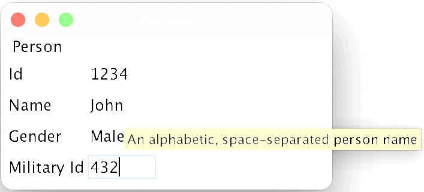

# Forms POC

This project explores the implementation (in Kotlin) of a forms generator that, 
given the metadata associated with a form, dynamically runs the form both as a
Swing application and as a web page.

This POC explores the following subjects:

- A general-purpose data definition DSL
- A _platform-independent_ GUI definition DSL
- Platform-dependent form interpreters (Swing, web)
- A platform-independent, _translatable_ expression language (Jexl, Javascript)

The data definition DSL should be capable of expressing arbitrarily complex
data structs made up of scalars, lists, sets and maps. This should make it
possible to pass forms rich seed object graphs (rather than, for instance,
only flat, tabular data.)

The GUI definition language should be declarative and expressive enough that
GUI descriptions can be _losslessly_ translated to a variety of target GUI
platforms such as web, Android (e.g. Jetpack Compose), iOS, etc.

The platform-dependent form interpreters should efficiently enact GUI
descriptions in platform-specific ways by leveraging each platform's native
capabilities and look-and-feel.

Finally, the type-safe, platform-independent expression language should 
translate expressions to each target platform such that, for instance,
any suitable JVM expression language (Jexl, JSR-223, etc.) can be used
for Swing, while Javascript can be generated for web. This is useful to,
for example, conditionally enabling/disabling form fields or sub-forms
depending on potentially complex runtime conditions.

## Tests Showing (off) the Approach:

> 👉 The impatient can look at and run tests [intrepretsSwing](https://github.com/xrrocha/forms-poc/blob/af61cfb8c8f4ec8b6288187700d795e78044e16b/src/test/kotlin/FormTest.kt#L77) and [interpretsWeb](https://github.com/xrrocha/forms-poc/blob/af61cfb8c8f4ec8b6288187700d795e78044e16b/src/test/kotlin/FormTest.kt#L83).

Given the following form definition (presented in Yaml, rather than Json, 
for readability):

```yaml
title: Person
border: true
fields:
  id: !string
    label: Id
    minLen: 8
    maxLen: 8
    regex: '\d{8}'
    validChars: '\d'
    fyi: 8 digits
    help: |
      ℹ️ Enter _exactly_ 8 digits.
      Doncha dare tell us we didn't warn you!
    errMsg: 'Invalid id: must be 8 digits'
  name: !string
    label: name
    minLen: 8
    maxLen: 24
    whitespace: normalize
    regex: '[\p{Alpha}]+([ \p{Alpha}]+)+'
    validChars: '[ \p{Alpha}]'
    fyi: An alphabetic, space-separated person name
  gender: !enum
    label: Gender
    values:
      f: ♀ Female
      m: ♂ Male
    fyi: Female (🚺) or male (🚹)
    renderAs: !radioButton
  militaryId: !string
    label: Military id
    minLen: 7
    maxLen: 7
    regex: '\d{7}'
    validChars: '\d'
    fyi: 8 digits
    help: |
      ℹ️ Enter _exactly_ 7 digits.
      Applies **only to males**; you've been warned!
    errMsg: 'Invalid military id: must be 8 digits'
```

the Swing interpreter renders:



while the Web interpreter renders:


